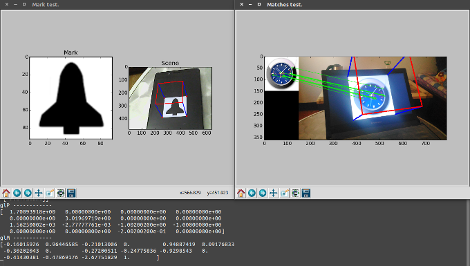
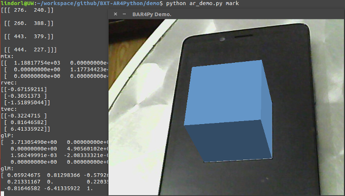
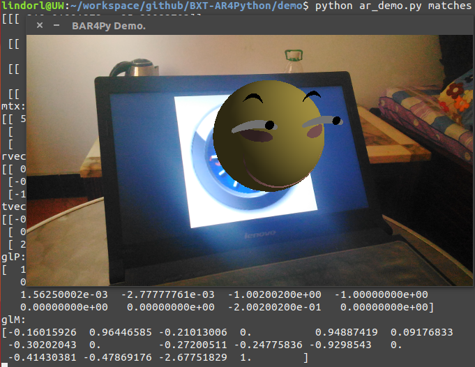

# BAR4Py（BXT-AR-For-Python）

**BAR4Py** 是由 **百晓通客栈×创客项目群** 着手开发的“增强现实（AR）”的 Python 开发库。

#### 特点：

- 基于 OpenCV，以及 Python 的数学库；
- 跨平台，可拓展，免费、开源；
- 支持简单的 Mark 标记物以及复杂的图像标记；
- 使用遗忘队列结构动态更新相机标定；

#### Test & Demo：

> 

> 

> 

---------------------------------------------------------

---------------------------------------------------------

