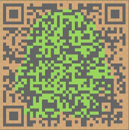

# BAR4Py（BXT-AR-For-Python）

**BAR4Py** 是由 **百晓通客栈×创客项目群** 着手开发的“增强现实（AR）”的 Python 开发库。

#### 特点：

- 基于 OpenCV，以及 Python 的数学库；
- 跨平台，可拓展，免费、开源；
- 支持简单的 Mark 标记物以及复杂的图像标记；
- 使用遗忘队列结构动态更新相机标定；

#### Test & Demo：

> 

> 

> 

#### 官方 WIKI：

主页：[Home](http://git.oschina.net/Lindor_L/BXT-AR4Python/wikis/home)

---------------------------------------------------------

### 开发团队成员信息

- 蔡为成，佛山职业技术学院（营销专业）；
- 周威，湖北警官学院（计算机科学与技术专业）；
- 刘永瑞，吉林大学（网络与信息安全）；
- 徐鹏，湖南邵阳学院（计算机科学与技术专业）；
- 陶智佳，成都电子科技大学（计算机科学）；
- 狄璒，百晓通客栈×自由编码群管理员；
- 庞江涛，齐鲁工业大学；
- 康鹏飞，陕西科技大学（网络工程专业）；

---------------------------------------------------------

#### 想了解更多关于 BAR4Py 的资讯，敬请关注 百晓通客栈×创客项目群

### QQ群号（431646132）

